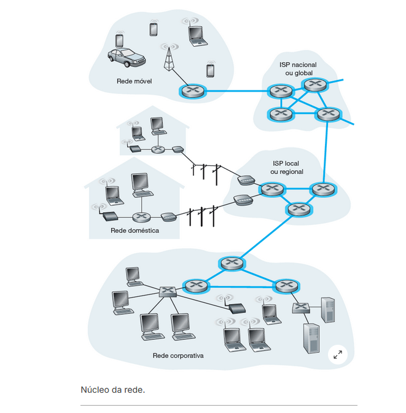

nucleo da rede sao por exemplo modems roteadores e switchs, eles que oferecem os caminhos que permitem as conexoes finais, linhas em azul:

ISP = internet service provider

- provedores regionais
- provedores nacionais
- provedores de transito
  - cabos submarinos

ponto de presença = POP

IXP = pontos de troca de trafego

o ISP cliente paga os ISP's provedores para ter acesso a internet
