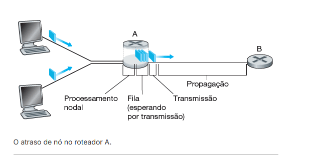

atrasos e literalmente quanto tempo leva para algo ser feito, tipo lag

tipos de atraso

- atraso de processamento nodal
  - tempo gasto em examinar o pacote e decidir a saida
- atraso de fila
  - literalmente uma fila, se a fila (buffer) estiver vazia, entao o tempo do pacote sera zero, mas se tiver varios arquivos o tempo da fila sera longo
- atraso de transmissão
  - tempo para transmitir todos os bits do pacote para o enlace
- atraso de propagação
  - distancia e tipo de meio utilizado, tempo para propagar o bit para o proximo nó, esse é diretamente relacionado a distancia entre os roteadores
- eles forma o _atraso total_

a variacao do efeito de atraso se chama jitter
