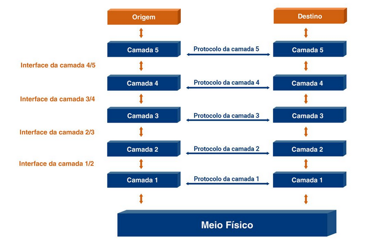

# divisao da estrutura das redes em camadas

## tecnica dividir para conquistar

dividimos o problema grande em problema pequeno e resolvemos eles de forma isolada, se cada problema pequeno for resolvido o grande tb sera resolvido

- a camada mais baixa é a 1
- a mais alta é a N

a camada superior utiliza os serviços da inferior, a 2 usa da 1, a 3 usa da 2
as camadas inferior oferece serviço para a camada superior

### serviço

funcionalidades que uma camada oferece

### protocolo

protocolo cria a regra que o serviço irá seguir

### interface

é o ponto de comunicação entre as camadas, sem a interface nao existe comunicação entre elas

- o computador usa os protocolos e interfaces

## comunicação horizontal e vertical

### vertical

é a forma de cima para baixo, onde a camada de cima usa o serviço da inferior, descendo

- na origem os dados descem até a camada mais baixa até chegar na transmissão (fibra otica por exemplo)
- no destino os dados fazem o caminho reverso, sobem até a mais alta de novo

### horizontal

é quando por exemplo, o protocolo 2 de origem "fala" com o protocolo 2 do destino
como se o protocolo 2 de origem preparasse o pacote para ser lido pelo 2 de destino e assim por diante

## encapsulamento

os dados da camada 2 por exemplo, serao lidos e executados pela camada 2 de destino, para isso ser feito ele salva as informações em um _cabeçalho_

cada camada adiciona mais um cabeçalho no dado a ser enviado, esse processo é oq chamamods de ENCAPSULAMENTO

ou seja, os dados sao encapsulados ate a camada 1, depois enviamos paara o destino, ao chegar no destilo os dados sao DESENCAPSULADOS ate chegar na camada N
