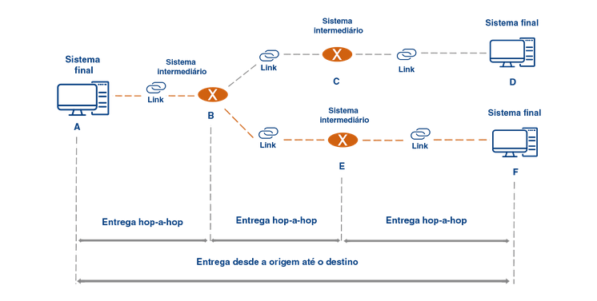
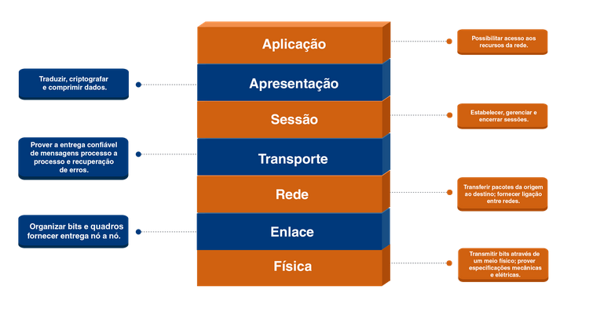

# modelo OSI

foi criado em 1970 pela ISO (international organization for standardization)

OSI = Open System Interconnection

as 7 camadas OSI

7. aplicacao
8. apresentacao
9. sessao
10. transporte
11. rede
12. enlace
13. fisica

elas sao divididas em 3 sub-grupos

- camadas mais altas (7,8,9)
  sao funcoes que dao suporte para o usuario conseguir acessar
- camadas mais inferiores (3,2,1)
  sao as camadas ligadas as movimentações dos dados de um dispositivo a outro
- camadas de transporte (4)
  ela permite que os dados que chegarem nas camadas mais baixas estejam em condições de serem utilizados pelas camadas mais altas

# camadas de aplicacao, apresentacao e sessao

## aplicacao

tipos de aplicacao

- servico web
- servico de correio eletronico (email)
- servico de transferencia de arquivos
- servico de streaming
- servico de compartilhamento de arquivo

## apresentacao

é o responsavel por fazer com que o sistema rode independente do tipo do tipo (nao importa ser celular, pc, notebook, e nem importa o sistema operacional)

ela é tipo o "tradutor da rede"

ou seja ela faz a conversao entre os dados, compressão e
criptografia

## sessao

é responsavel por criar a sessao entre os dispositivos, entao ela faz o controle de dialogo e sincronização

### controle de dialogo

define quem transmitira em qual momento, os 2 podem falar ao mesmo tempo? full duplex, 1 por vez? half duplex

### sincronizacao

# camadas de transporte e rede

## transporte

ela garante a entrega de todos os dados enviados pelos usuarios
é a camada mais complexa do modelo OSI,

## rede

faz a comunicação de maquina a maquina, diferente da camada de rede que faz processo por processo

pra fazer isso ela precisa de um

### endereço logico

endereço da porta

### roteamento

é o "caminho" que os dados vao percorrer

# camadas de enlace e fisica

## transporte

realiza a entrega confiavel processo a processo

## enlace

realiza a entrega confiavel entre maquinas adjacentes nó a nó

muitos atributos da camada de transporte tb estao presentes na camada de enlace

- controle de erros
- controle de acesso ao meio
- endereçamento fisico
- controle de fluxo
- enquadramento

## fisica

essa camada é responsavel por transmitir os dados pelo meio de transmissao

- taxa de dados
- sincronizacao dos bits
- topologia fisica
- modo de transmissão

