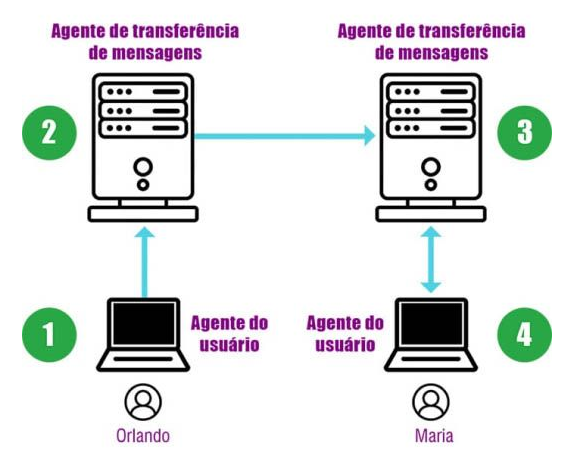
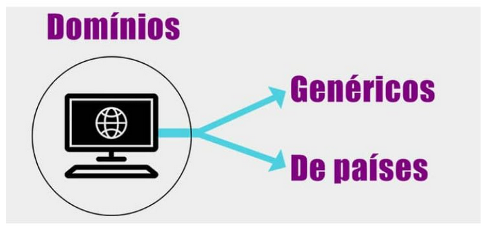
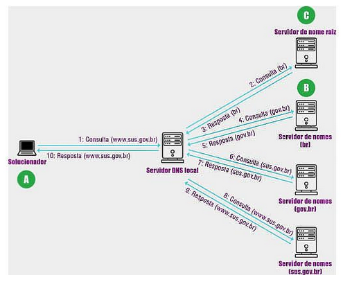
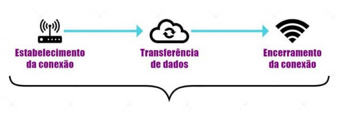
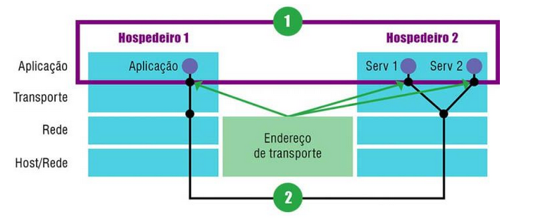
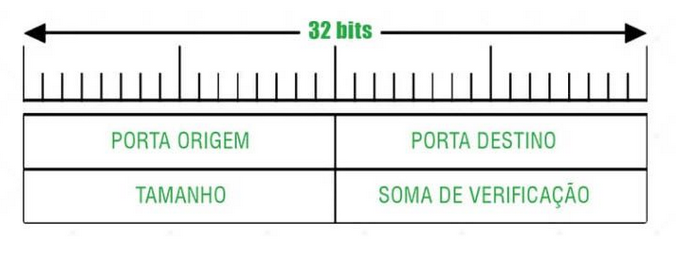
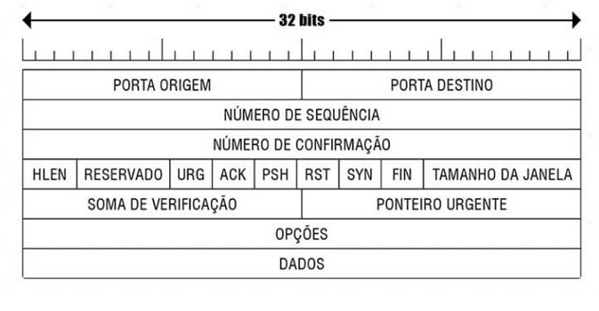
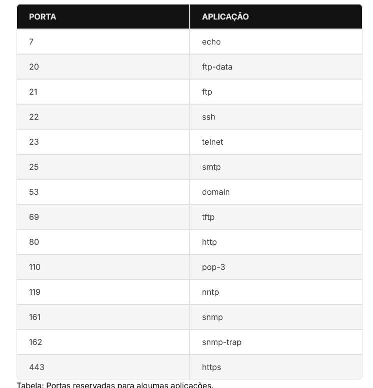

# protocolos de camada de aplicacao

oq é um protocolo de camada de aplicacao
ele define como processos de uma aplicacao, funcionando em sistemas diferentes, passam mensagens entre si:

- os tipos de mensagens trocadas (ex; requisicao e respostas)
- a sintaxe dos varios tipos de mensagens, tipo os campos de mensagens e como os campos sao delineados
- a semantica dos campos, ou seja o significado da informação nos campos
- regras para determinar quando e como um processo envia e responde mensagens

## serviços da camadas de aplicacao

### serviço web (protocolo HTTP)

é um protocolo e muita gente confundo como a propria internet kkk

### serviço de correio (protocolos SMTP,IMAP e POP)

serviço de correio eletronico

### serviço de nomes (DNS)

Sistema de resolução de nomes DNS

# serviço WEB

## https

hypertext transfer protocol
RFCs 1945 e 2616

- uma pagina web é um documento em formato HTML
  o cliente digita o endereço da pagina ou clica em um hiperlink, dai o cliente faz uma requisicao ao servidor para o server mostrar a pagina,
- esse padrao é o protocolo HTTP, a mensagem HTTP é carregada pelo protocolo TCP
- a solicitação mais comum é
  - o usuario enviar um texto em formato ASCII
  - iniciar com a palavra GET
  - inserir pagina solicitada

# servico de correio eletronico

foi criado a partir da MIME

- multipurpose internet mail extensions
  ele passou a definir regras para as mensagens especiais

atualmente usamos o protocolo SMTP

- simple mail transfer protocol
  RFC 5321
  RFC 5322

- como é construida a arquitetura do correio eletrônico
  construida com base em 2 agentes

1. do usuario
   - os agentes do usuario é o programa que faz a interface do usuario com o sistema de correio eletronico
   - faz o envio e download de mensagens e anexos
   - le as mensagens
   - realiza a pesquisa, o arquivamento e o descarte de mensagens
   - escreve suas mensagens
   - anexa os arquivos
2. de transferencia de mensagens
   - sao responsaveis por fazer com que as mensagens cheguem até o destino
   - sao conhecidas por servidores de correio eletronico

exemplo do caminho que a mensagem faz utilizando o topico em questao

## SMTP

é o protocolo responsavel pela transferencia de mensagem até o destino
RFC 5321
protocolo de transporte TCP

## POP3

Post office protocol version 3
tem a finalidade de fazer o download das mansagens no mailbox do usuario para o sistema local

## IMAP

internet message acess protocol
permite o usuario a ler as mensagens diretamente do servidor, dispensando a necessidade de fazer o download para o sistema local

- tb permite criar, excluir e manipular varias caixas de correio no servidor

# servico de nomes

## DNS

Domain Name System
é mais facil trabalhar com nome dos hospedeiros doq com seus endereços de rede
tb oferece:

- identificacao de servidores de correios eletronics
- apelidos para hospedeiros
- distribuicao de carga
- descoberta de nomes de hospedeiros (mapeamento reverso)

## espaco de nomes

### dominions genericos

informam o tipo de organizacao que o dominio esta vinculado, tipo:

- .com
- .edu
- .int
- .org

### dominios de paises

sao entradas unicas para cada pais, tipo:

- .br
- .pt
- .jp
- .ar

o DNS é implementado pelo protocolo UDP

## resolução de nomes

é dividido em zonas possuindo uma de nomes principal e pelo menos 1 de nomes secundario

### servidor de nomes principal

é o principal e tem as zonas de nomes secundarios sobre sua responsabilidade

### secundarios

responde pelas zonas caso haja uma falha do servidor de nomes principal

como evitar sobrecarga no servidor DNS?

- os servidores devem evitar consultar recursivas de clientes nao autorizados, o administrador deve configurar no servidor aqueles autorizados a fazer consulta recursiva, um tipo de whitelist.

# elementos da camada de transporte

## a camada de transporte na internet

a camada de transporte promove a confiabilidade na transferencia de dados de forma independente das redes

### servico de transporte

no serviço de transporte orientado a conexao, existem 3 fases

## enderecamento (camada de transporte)

o cabeçalho é responsavel por dizer oq os protocolos devem e podem fazer

- o endereçamento é responsavel por indicar em qual aplicacao a mensagem deve ser entregue
  

## multiplexacao e demultiplexacao

elas fornecem um serviço de entrega

como o hospedeiro destino direciona a porta correta a uma segmento que chega?

- cada segmento da camada de transporte tem um conjunto de camadas de endereçamento no cabeçalho. o receptor da camada de transporte examina esses campos para identificar a porta receptora e direcionar o segmento a ela
  - a tarefa de entregar os dados em um segmento na porta correta é DEMULTIPLEXAÇÃO

já a MULTIPLEXAÇÃO:

- o hospedeiro reunir partes de dados de diferentes portas
- encapsular cada parte com as info de cabeçalho, para criar segmentos
- passar os segmentos para a camada de rede

entao a multiplexacao permite que varios programas possam usar o TCP ao mesmo tempo

### MULTIPLEXAÇÃO

faz com que o protocolo de transporte identifique a porta das mensagens enviadas pelas aplicacoes, permitindo que varias aplicacoes possam ser utilizadas ao mesmo tempo

### DEMULTIPLEXAÇÃO

ele faz o transporte da mensagem verificando o numero da porta, e entrega a mensagem para o processo registrado nela

# protocolos de transporte de internet

vamos estudar dois exemplo de protocolo de transporte da internet: TCP e UDP

## protocolo UDP

ele é um protocolo rapido na entrega de mensagens, faz a multiplexacao e demultiplexacao e tb verifica erros na entrega

- em porta origem ele escreve qual a porta em que a mensagem foi originada
- porta destino é em qual porta a resposta deve ser enviada
- o tamanho especifica o tamanho do segmento, sao 16 bits entao: 65,536 bytes
- o campo de soma de verificacao é o que faz o tratamento da mensagem para ficar livre de erros, ele compara o CRC da origem e do destino, se ambos forem iguais a mensagem é livre de error e entregue na aplicacao destino

o UDP nao garante confiabilidade na transmissão.
protocolos que usam o UDP:

- DNS
- SNMP
- TFTP
- RPC

## protocolo TCP

é orientado para conexao, ele oferece um fluxo de dados CONFIAVEL,
ele envia cada datagrama IP com 64Kbytes no maxiom
datagrama IP = pacote

3 aspectos fundamentais do TCP:

1. modelo de serviço TCP
   todas conexoes TCP sao
   - full duplex: dados podem ser enviados e recebidos simultaneamente por ela, tipo uma linha telefonica onde permite que as pessoas falam ao mesmo tempo, o walkie talkie já é o contrario
   - ponto a ponto: ligação direta entre 2 hospedeiros, sem um terceiro, tipo quando ligamos um celular no pc via cabo, é uma ligacao direta entre os 2.
2. cabeçalho de segmento TCP
3. gerenciamento de conexão TCP

janela deslizante

- é o protocolo basico utilizado pelo TCP,
- ele permite o envio de dados mesmo sem a confirmação dos enviados anteriormente,
- conforme eles vao sendo confirmados, o ponto inicial da janela de transmissão move-se no sentido do fluxo dos dados, por isso chamamos deslizante

### selective repeat e go-back-n

selective repeat é quando o transmissor identifica uma falha e re-transmite exatamente onde ocorreu essa falha

no go-back-n sempre q tem um erro e o transmissor percebeu, ele volta aquele estado e re-transmite nao só as falhas, mas todo aquele segmento, entao ele re-transmite tudo a partir daquele erro

## cabeçalho TCP

### cabeçalho de segmento TCP

exemplo de segmento TCP:

- porta origem e porta destino
  identificam abas as portas para que as aplicacoes possam fazer o uso do protocolo de transporte: multiplex e demultiplex
- numero de sequencia
  indica o numero da sequencia do segmento, ou seja em qual posição bytes dos dados eles devem ser colocados
- numero de confirmação
  Especifica o próximo byte aguardado no fluxo contrário. Quando é enviado do processo A para o B, indica o próximo byte que A espera receber no fluxo de B para A. Quando informa que espera receber o byte N, fica implícito que todos os bytes até N-1 foram recebidos corretamente.
  -HLEN = header length
  o tamanho do cabeçalho em palavras de 32 bits
- reservado
  nao utilizamos esse campo, qualquer valor nele é desconsiderado
  -campos de flags de 1 bit
  só pode ter valores de 0 a 1, 0=desligado, 1=ligado
- URG = urgent pointer
  usado para segmentos que carregam dados urgentes
- ACK = acknowledgement
  serve pra indicar que o campo "numero de confirmacao" contem uma confirmação, ai usa o 1=positivo
- PSH = push
  serve pra entregar os dados diretamente a aplicacao ao inves de guardar em um buffer
- RST = reset
  é pra resetar uma conexao, rejeitar ou recurar uma tentativa de conexao
- SYN = serve para estabelecer conexões
- FIN = serve para encerrar uma conexão
- Tamanho da janela
  indica o tamanho da janela que sera usado na janela deslizante
- Soma de verificação
  serve para conferir se existem error nos dados recebidos, verifica ambos os cabeçalhos
- ponteiro urgente
  só é valido se a flag URG estiver ativada, indicar os dados urgentes
- opções
  recursos extras
- dados
  sao os dados enviados a camada superior

## conexao TCP

responsavel por estabelecer o contato cliente-servidor

- utiliza o three-way-handshake

### politica de transmissao TCP

fluxo de dados entre transmissor e receptor

## tipo de portas

a porta TCP e UDP sao numeros inteiros de 16bits
portas reservadas para alguma aplicação:

