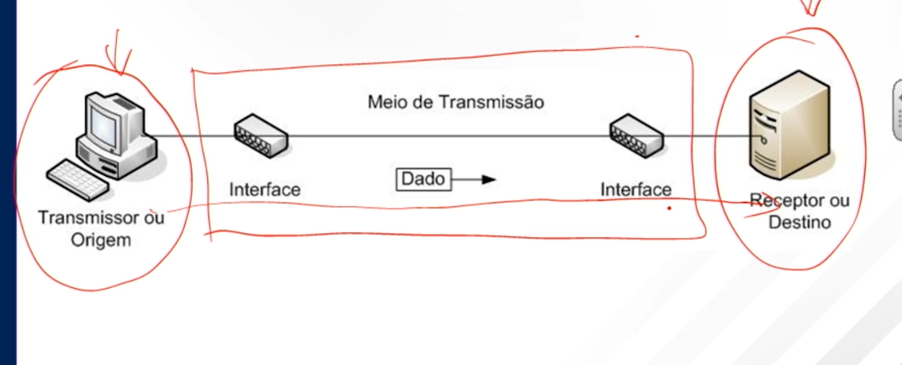

a internet é um conjunto de redes que utilizando protocolo TCP e IP, interconecta bilhoes de dispositivos de computação no mundo todo

a internet é dividida em varias partes, sendo as mais importantes:

- borda da rede
  - sao os computadores, notebook, celulares..
- nucleo da rede
  - onde a infra de rede se localiza
- redes de acesso
