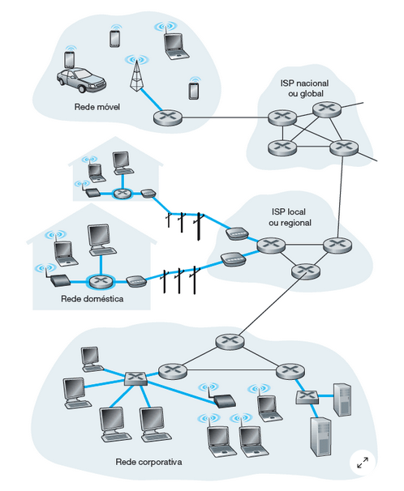

a rede de acesso conecta os sistemas finais (computador, celular, tablet) ao primeiro roteador, do roteador ele conecta até outro qualquer, entao podemos afirmar que a rede de acesso é um meio fisico a qual as redes se conectam

- meios guiados sao os cabos por exemplo, fibra otica, par metalico, cabo coaquicial, cabo de par trançado..

- meios nao guiados sao redes wireless

rede de acesso sao as linha azuis

as redes de acesso residencial sao DSL (linha digital de assinante)

ja na fibra otica temos FTTH (fiber to the home) que é um caminho direto para a casa, esse nao é um protocolo, apenas um conceito

---

# redes LANs

usam o padrao IEEE 802.11
geralmente usadas em redes domesticas ou de escolas por exemplo, utilizam ETHERNET que geralmente sao usam cabos metalicos, ou redes sem fio WIFI
