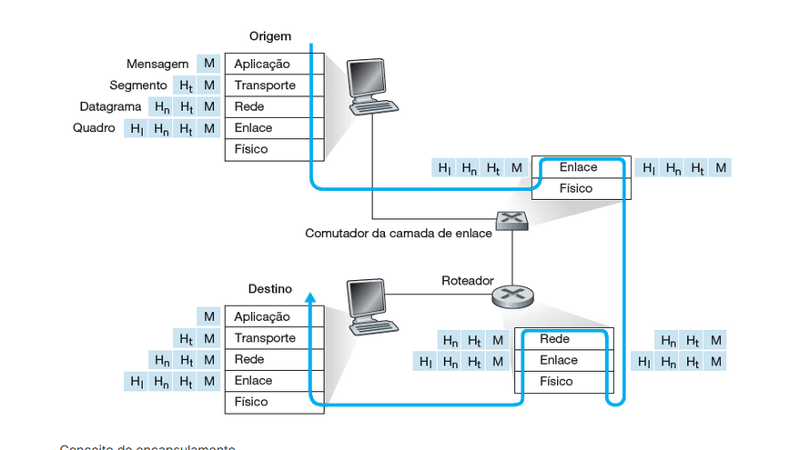

o encapsulamento é tipo colocar tudo dentro de um pacote, pode ser feito a analogia de uma empresa de logistica

1. aplicacao
2. transporte
3. rede
4. enlace
5. fisica

- desenha um heroi - essa é a MENSAGEM
  camada de transporte
- coloca o heroi dentro do envelope e escreve, isso é para o "lucas", esse é PACOTE - SEGMENTO
  camada de rede
- colocamos o pacote dentro de uma caixa grande e colocamos o endereço completo do lucas, esse é o DATAGRAMA DA CAMADA DE REDE
  camada de enlace
- é como o correio, eles colocam outro rotulo com informacoes sobre quem vai receber, isso é QUADRO DE CAMADA DE ENLACE
  camada fisica
- o carteiro pega a caixa e leva pela rua e estrada, isso é ENVIAR OS BITS

---

desencapsulamento é tudo ao contrario:
eu recebo a caixa e ai eu:

1. tiro da caixa - ENLACE
2. abre o envelope - TRANSPORTE
3. leio o desenho - APLICACAO

