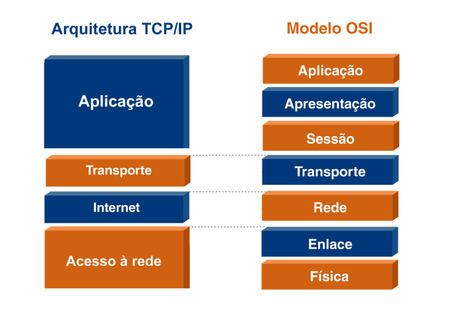
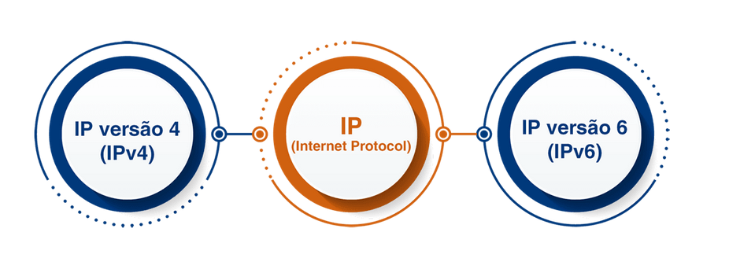
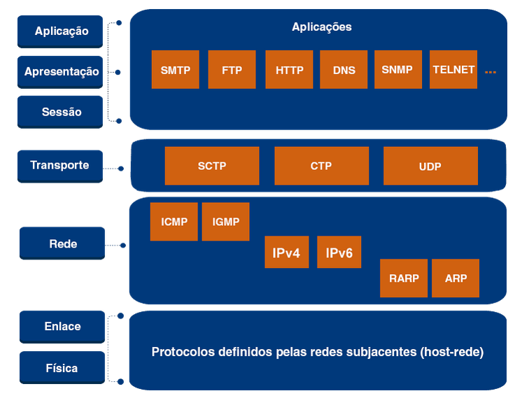

# oq é TCP IP?

TCP = TRANSMISSION CONTROL PROTOCOL
IP = INTERNET PROTOCOL

foi criada em 1974 para permitir uma rede de comunicacao entre dispositivos diversos

tem 4 camadas

1. aplicacao
2. transporte
3. internet

- rede ou inter-rede

4. acesso a rede

- enlace, host-rede, intrarrede e host-network

como o TCP IP tem menos camadas q o OSI, é logico pensar que 1 funcao do TCP IP pode fazer varias do OSI

a grande diferença entre OSI e TPC IP

## OSI

baseado principalmente nas funcionalidades das camadas

## TCP IP

nao fica presa só nas funcionalidades, tb amplicou para desenvolvimento de protocolos, de maneira hierarquica, as camadas superiores sao suportadas pelas camadas inferiores

os principais protocolos foram feitos pela IETF
IETF = THE INTERNET ENGINEERING TASK FORCE

# funcoes e principais protocolos

## aplicacao

a seguir alguns dos serviços utilizados na camada de aplicacao

web - HTTP,HTTPS
correio eletronico - SMTP,POP,IMAP
nomes - DNS
transferencia de arquivo - FTP,TFTP
audio e video em tempo real - RTP
configuração automatica de estacoes - DHCP

os protocolos acima sao implementados por meio de softwares, sao associados a dois tipos principais de arquitetura

### cliente servidor

existe um cliente e um servidor, o cliente sera executado por um usuario como Nós e ira pedir um serviço do servidor, tipo uma pagina web, que pede o conteudo para o servidor

### par a par, P2P

a ideia é que os usuarios possam trocar informaçoes de forma direta, de preferencia sem um servidor, tipo compartilhamento de arquivos ou chat entre duas pessoas

## transporte

mesma funcionalidade do transporte do modelo OSI:
_garantir a entrega de processo a processo de todos os dados enviados pelo usuario_

no TPC IP temos dois protocolos principais:

### TCP

ele confere a confiabilidade

- divide a mensagem (PDU-A)
- da camada de segmentos (PDU-T)
- determinando o numero de sequencia para cada uma

### UDP

UDP = User Datagram Protocol

esse nao confere confiabilidade

ele é o oposto do TCP, ele nao é orientado a conexao e nao faz a maioria das funcoes da camada de rede, ele existe apenas para que uma mensagem (PDU-A) seja encapsulada em um datagrama (PDU-T) e entregue para o processo de destino correto.

ENTAO PQ USAMOS O UDP????

- ele é importante para as aplicações que precisam de tempo de resposta baixo na comunicacao, como um audio ou uma videochamada

## internet

essa camada tem o simples objetivo de permitir que os dados na enviados na rede pela maquina de origem chegue ao destino, o principal protocolo da rede é o IP

TEMOS DUAS VERSOES PRINCIPAIS

### IPV4

### IPV6

os dois protocolos tem o objetivo de definir o endereço logico o tal do IP, e tratar os datagramas (PDU-R)

QUAL A DIFERENÇA ENTRE IPV4 E IPV6??????

- a diferença é o tamanho do endereço logico

  - 32 bits para o ipv4
  - 128 bits para o ipv6
  - e formato do datagrama

- os dois protocolos nao sao orientado a redes
- nao tem confiabilidade ou seja NAO FAZEM TRATAMENTO DE ERROS
- os datagramas sao enviados de forma independente, podendo chegar em ordem diferente da que foi enviada

qualquer problema entao tem que ser corrigido pelas camadas superiores

## acesso a rede

