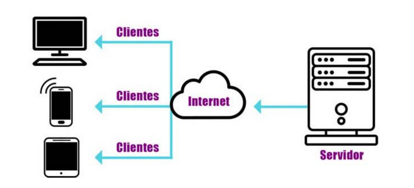
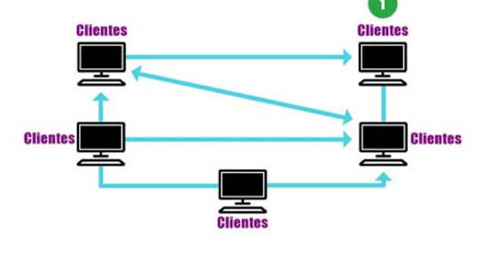
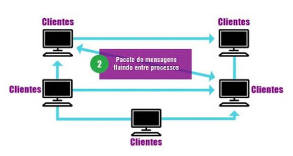
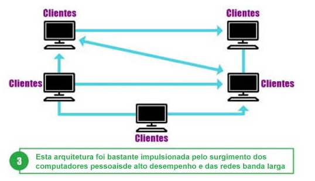

# arquiteturas e camadas de aplicacao

ja sabemos q os softwares rodam nessa camada

## arquitetura cliente servidor

o servidor executa operacoes continuas esperando a requisicao de um cliente

### servidor

quando chega uma solicitacao para o servidor, ele pode

- atender imediatamente caso esteja ocioso
- gerar um processo filho para a solicitacao
- enfileirar a solicitacao para ser atendida mais tarde
- criar uma thread para esse atendimento

- o software que determina se a entidade é cliente ou servidor
- um processo pode ser cliente e servidor ao mesmo tempo

## arquitetura peer to peer P2P

tanto o processamento quanto o armazenamento das informações sao distribuidos entre os hospedeiros.

