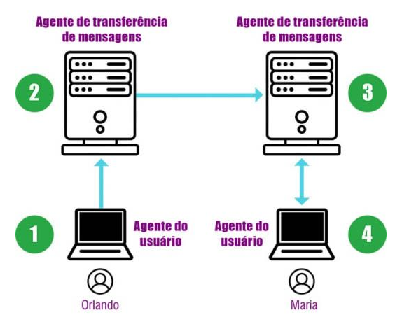
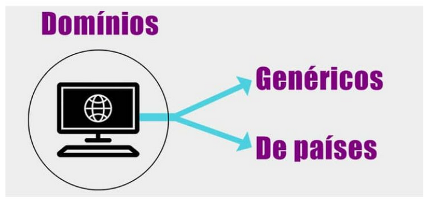
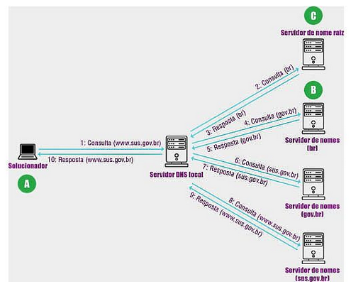

# protocolos de camada de aplicacao

oq é um protocolo de camada de aplicacao
ele define como processos de uma aplicacao, funcionando em sistemas diferentes, passam mensagens entre si:

- os tipos de mensagens trocadas (ex; requisicao e respostas)
- a sintaxe dos varios tipos de mensagens, tipo os campos de mensagens e como os campos sao delineados
- a semantica dos campos, ou seja o significado da informação nos campos
- regras para determinar quando e como um processo envia e responde mensagens

## serviços da camadas de aplicacao

### serviço web (protocolo HTTP)

é um protocolo e muita gente confundo como a propria internet kkk

### serviço de correio (protocolos SMTP,IMAP e POP)

serviço de correio eletronico

### serviço de nomes (DNS)

Sistema de resolução de nomes DNS

# serviço WEB

## https

hypertext transfer protocol
RFCs 1945 e 2616

- uma pagina web é um documento em formato HTML
  o cliente digita o endereço da pagina ou clica em um hiperlink, dai o cliente faz uma requisicao ao servidor para o server mostrar a pagina,
- esse padrao é o protocolo HTTP, a mensagem HTTP é carregada pelo protocolo TCP
- a solicitação mais comum é
  - o usuario enviar um texto em formato ASCII
  - iniciar com a palavra GET
  - inserir pagina solicitada

# servico de correio eletronico

foi criado a partir da MIME

- multipurpose internet mail extensions
  ele passou a definir regras para as mensagens especiais

atualmente usamos o protocolo SMTP

- simple mail transfer protocol
  RFC 5321
  RFC 5322

- como é construida a arquitetura do correio eletrônico
  construida com base em 2 agentes

1. do usuario
   - os agentes do usuario é o programa que faz a interface do usuario com o sistema de correio eletronico
   - faz o envio e download de mensagens e anexos
   - le as mensagens
   - realiza a pesquisa, o arquivamento e o descarte de mensagens
   - escreve suas mensagens
   - anexa os arquivos
2. de transferencia de mensagens
   - sao responsaveis por fazer com que as mensagens cheguem até o destino
   - sao conhecidas por servidores de correio eletronico

exemplo do caminho que a mensagem faz utilizando o topico em questao

## SMTP

é o protocolo responsavel pela transferencia de mensagem até o destino
RFC 5321
protocolo de transporte TCP

## POP3

Post office protocol version 3
tem a finalidade de fazer o download das mansagens no mailbox do usuario para o sistema local

## IMAP

internet message acess protocol
permite o usuario a ler as mensagens diretamente do servidor, dispensando a necessidade de fazer o download para o sistema local

- tb permite criar, excluir e manipular varias caixas de correio no servidor

# servico de nomes

## DNS

Domain Name System
é mais facil trabalhar com nome dos hospedeiros doq com seus endereços de rede
tb oferece:

- identificacao de servidores de correios eletronics
- apelidos para hospedeiros
- distribuicao de carga
- descoberta de nomes de hospedeiros (mapeamento reverso)

## espaco de nomes

### dominions genericos

informam o tipo de organizacao que o dominio esta vinculado, tipo:

- .com
- .edu
- .int
- .org

### dominios de paises

sao entradas unicas para cada pais, tipo:

- .br
- .pt
- .jp
- .ar

o DNS é implementado pelo protocolo UDP

## resolução de nomes

é dividido em zonas possuindo uma de nomes principal e pelo menos 1 de nomes secundario

### servidor de nomes principal

é o principal e tem as zonas de nomes secundarios sobre sua responsabilidade

### secundarios

responde pelas zonas caso haja uma falha do servidor de nomes principal

como evitar sobrecarga no servidor DNS?

- os servidores devem evitar consultar recursivas de clientes nao autorizados, o administrador deve configurar no servidor aqueles autorizados a fazer consulta recursiva, um tipo de whitelist.

# elementos da camada de transporte
